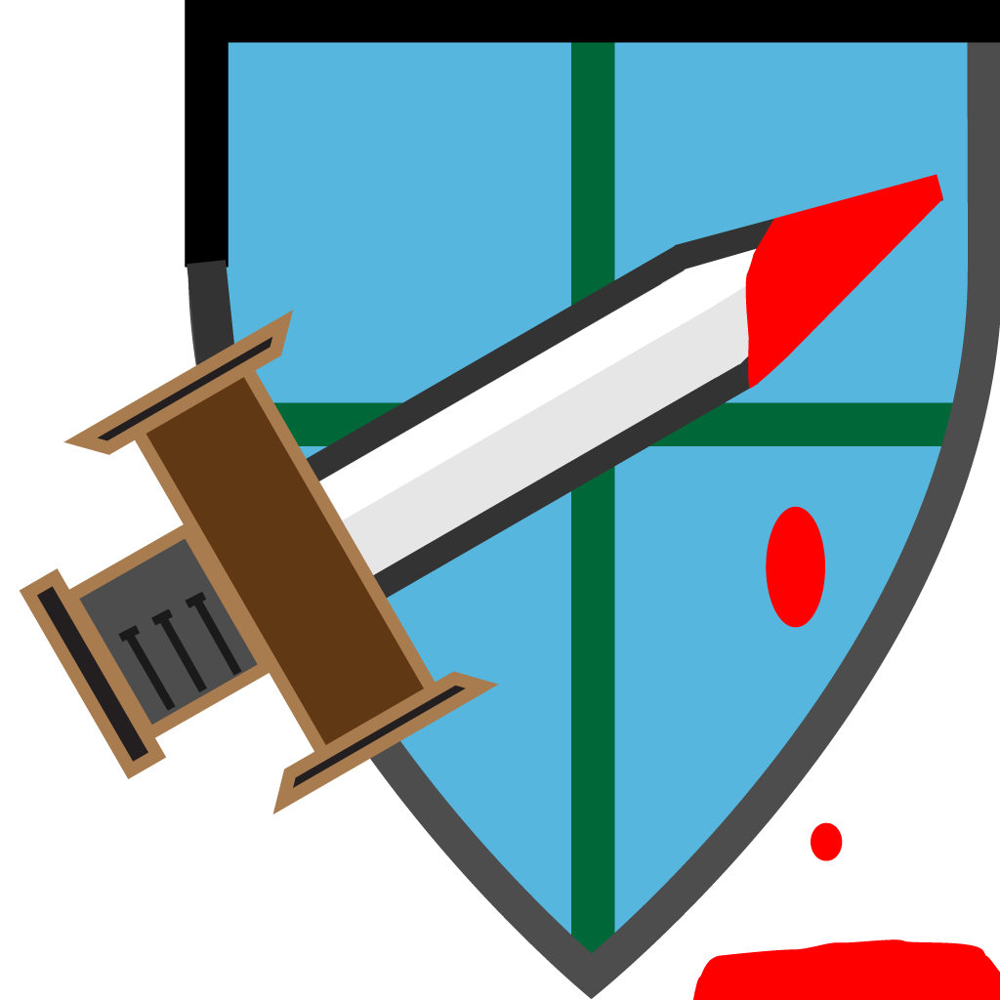

= Test
Jon
:icons:
:toc: left
:toclevels: 2
// :toc-placement: manual
:max-width: 100
:numbered:
:doctype: book
:imagewidth: 800
:fullimagewidth: {svgpdf@pdf:scaledwidth="75%":width="800"}
:sym1: &#x2713;
:sym2: &#x2020;

<<<<

[[introduction]]
== Introduction

An image:

include::bar.adoc[]
